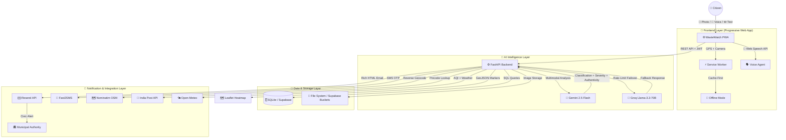

<div align="center">


# 🌿 WasteWatch

### India's First AI-Native Civic Waste Intelligence Platform

**Built for Bharat · Powered by Google Gemini 2.5 Flash · Engineered with Google Antigravity**

[](https://python.org)
[](https://fastapi.tiangolo.com)
[](https://aistudio.google.com)
[](https://web.dev/progressive-web-apps/)
[](https://wastewatch224.onrender.com/)
[](#-comprehensive-testing)
[](LICENSE)

---

### 🚀 [Live Demo](https://wastewatch224.onrender.com/) &nbsp;|&nbsp; 📁 [Source Code](https://github.com/Vk2245/Google-H2S-Virtual-PromptWars-19-april-2026-) &nbsp;|&nbsp; 🛡️ [Security](#-security--integrity) &nbsp;|&nbsp; 🧪 [Tests](#-comprehensive-testing)

> **Demo Credentials:** Phone `8989893838` · Password `demo@123` · OTP `123456`

</div>

---

## 📋 Table of Contents

- [The Crisis](#-the-crisis-municipal-waste-in-india)
- [Our Solution](#-the-wastewatch-solution)
- [Google Ecosystem Deep Dive](#-google-ecosystem-deep-integration)
- [System Architecture](#-system-architecture)
- [Feature Showcase](#-feature-showcase)
- [API Reference](#-api-reference)
- [Technology Stack](#-technology-stack)
- [Security & Integrity](#-security--integrity)
- [Testing](#-comprehensive-testing)
- [Deployment & Scaling](#-deployment--scaling)
- [Getting Started](#-getting-started-local-development)
- [Project Structure](#-project-structure)
- [Credits](#-credits--acknowledgments)

---

## 🎯 The Crisis: Municipal Waste in India

<table>
<tr>
<td width="60%">

India generates over **150,000 tonnes** of municipal solid waste **every single day**. Despite the transformative Swachh Bharat Mission (Clean India Mission), a critical gap remains — the **"Last-Mile Civic Reporting Gap."**

### The Three Pillars of Failure

| Problem | Impact |
|:---|:---|
| **🚫 No Structured Reporting** | WhatsApp complaints are ignored, phone calls are untracked, and resolution timelines are non-existent |
| **🔇 Digital Exclusion** | Civic tools often exclude illiterate or non-technical users, particularly those who think in Hindi, Tamil, or Bengali |
| **🗺️ Municipal Blindness** | Authorities lack real-time hotspot maps to prioritize cleanup efforts based on severity and public health risk |

</td>
<td width="40%" align="center">

```
📊 India's Waste Crisis (Daily)
═══════════════════════════════
🗑️  150,000+ tonnes generated
♻️  Only 30% processed
🏙️  62+ cities critically affected
👥  1.4B citizens, no unified tool
═══════════════════════════════
```

</td>
</tr>
</table>

**WasteWatch** is the bridge. We transform every smartphone-wielding citizen into an **Eco-Warrior** with AI-powered tools that classify, route, and resolve waste reports with surgical precision.

---

## 💡 The WasteWatch Solution

We don't just report waste — we **analyze, classify, verify, and route it** to the correct municipal authority using the full Google AI stack.

<table>
<tr>
<td width="50%">

### 🤖 Intelligent Core — Google Gemini 2.5 Flash

Our multimodal AI engine doesn't just "see" an image — it **understands civic context**:

- **Visual Classification** — Differentiates between wet, dry, hazardous (e-waste, batteries), and construction debris using Gemini's vision capabilities
- **Severity Scoring** — Calculates real-time severity (Low / Medium / High) based on proximity to schools, hospitals, drains, and residential density
- **Authenticity Verification** — Validates whether uploaded photos are genuine civic waste reports (rejects selfies, memes, stock photos, and AI-generated images)
- **Personalized Disposal Guides** — Gemini generates context-aware, India-specific disposal instructions (kabadiwala pickup, authorized e-waste centers, Nagar Nigam contact points)
- **City-Level Narrative Intelligence** — Produces AI-written analytical summaries of citywide waste trends for municipal dashboards

</td>
<td width="50%">

### 🗣️ Inclusive Voice Agent — Bilingual AI Assistant

To ensure **Civic Inclusion** for all of India's diverse population:

- **Vernacular Support** — Full reporting flow available in both **Hindi 🇮🇳** and **English 🌍**, switchable at any time
- **Voice-First Navigation** — Users can speak their reports aloud; the Web Speech API transcribes and the AI processes user intent
- **Text-to-Speech Feedback** — AI responses are spoken back to the user, enabling fully hands-free interaction
- **Guided Reporting Wizard** — Step-by-step voice prompts walk first-time users through the entire reporting flow
- **Groq Llama Failover** — When Gemini hits rate limits, the system transparently falls back to **Groq (Llama-3.3-70B)** to ensure zero-downtime responses

</td>
</tr>
</table>

<table>
<tr>
<td width="50%">

### 🏆 Civic Gamification Engine

Sustained civic engagement requires **motivation mechanics**:

- **Dynamic XP System** — Earn 10–18 points per verified report based on severity, photo quality, and location uniqueness
- **10 Achievement Badges** — Unlock milestones like `🏅 First Report`, `🦸 Vigilante (10+ reports)`, `💯 Century (100+ XP)`, `🏆 City Champion (#1 rank)`
- **Multi-Scope Leaderboards** — Compete at national, state, and pincode level with real-time rankings
- **Anti-Gaming Shield** — 200m geofencing prevents duplicate reports; AI authenticity scoring blocks fraud attempts; per-hour rate limiting stops spam

</td>
<td width="50%">

### 📡 Smart Authority Notification System

Every report reaches the **right** government office:

- **100+ Municipal Authorities** — Pre-mapped database covering cities across 22 Indian states and union territories
- **3-Tier Resolution Cascade** — City match → District match → State nodal officer → National Swachh Bharat fallback
- **Rich HTML Email Alerts** — Professionally formatted emails with category, severity, GPS coordinates, Google Maps link, photo evidence, and AI-generated action plans
- **Pincode Intelligence** — India Post API lookup cross-references report pincodes with authority jurisdictions for precision routing
- **Email + Mailto Fallback** — If Resend API is unavailable, a pre-formatted `mailto:` link is generated so users can send alerts manually

</td>
</tr>
</table>

---

## 🔷 Google Ecosystem Deep Integration

WasteWatch is designed as a **Google-first** application, leveraging the Google ecosystem at every layer:

| Layer | Google Service | How It's Used |
|:---|:---|:---|
| **🧠 AI Intelligence** | **Google Gemini 2.5 Flash** | Multimodal waste classification (image + text), severity scoring, disposal guide generation, city analytics narratives, voice agent reasoning, and 7-day waste trend predictions |
| **🔤 Typography** | **Google Fonts (Inter)** | All UI text uses the Inter typeface loaded via `fonts.googleapis.com` for premium reading experience across all devices |
| **🗺️ Geolocation** | **Google Maps Links** | Every report generates a `maps.google.com` deep link; authority email alerts include clickable Google Maps coordinates |
| **☁️ Cloud-Ready** | **Google Cloud Run** | Application is containerized with Docker-compatible `render.yaml` and designed for seamless migration to Cloud Run |
| **📊 Analytics-Ready** | **Firebase Analytics** | Frontend is structured with event-ready hooks for Firebase Analytics integration (gtag-compatible) |
| **🔍 AI Studio** | **Google AI Studio** | Gemini API keys are provisioned through AI Studio; prompt engineering was developed and tested using the AI Studio playground |
| **🛠️ Development** | **Google Antigravity** | Entire development lifecycle — from architecture to deployment — was orchestrated using the Antigravity AI coding agent |

---

## 🏗️ System Architecture



### Data Flow — From Report to Resolution

```
📸 Photo Captured → 📤 Upload to Backend → 🧠 Gemini Multimodal Analysis
    ↓                                              ↓
🗂️ Classification                          🔍 Authenticity Check
(Garbage/E-waste/Debris)                   (Score 0-100, reject if <10)
    ↓                                              ↓
📍 GPS + Reverse Geocode ──→ 🏢 Authority Resolution (100+ cities)
    ↓                                              ↓
💾 Save to Database ──→ ✉️ Rich Email Alert to Municipal Commissioner
    ↓
🏆 Award XP + Check 10 Badge Conditions + Update Leaderboard
```

---

## ✨ Feature Showcase

<details>
<summary><b>🔐 Authentication System</b> — OTP-based registration with Demo Mode</summary>

- **Phone + OTP Registration** — Industry-standard two-factor authentication via Fast2SMS
- **SHA-256 Password Hashing** — Secure credential storage with no plaintext passwords
- **Token-Based Sessions** — Cryptographically random 32-character hex tokens for API authorization
- **Demo Mode** — When no SMS provider is configured, the system activates a developer-friendly mode with OTP bypass (`123456`) and pre-seeded test accounts
- **Input Sanitization** — All user inputs are stripped of HTML tags to prevent XSS attacks

</details>

<details>
<summary><b>📊 Analytics Dashboard</b> — City-level intelligence powered by Gemini</summary>

- **Waste Trend Prediction** — Gemini analyzes 30 days of historical data and forecasts waste volume for the next 7 days with daily risk levels
- **Area Risk Score** — Real-time 0–100 risk score calculated using the Haversine formula against all reports within a 1km radius
- **City Intelligence Narrative** — AI-generated 2–3 sentence summaries identifying the worst-affected cities, dominant waste categories, and actionable recommendations
- **Environmental Context** — Real-time AQI (PM2.5, PM10, NO₂) and weather data from Open-Meteo, with smart warnings like "⚠️ Rain increases flooding risk from waste blockages"

</details>

<details>
<summary><b>🗺️ Interactive Hotspot Map</b> — Real-time waste heatmap with clustering</summary>

- **Leaflet.js Integration** — High-performance map rendering with OpenStreetMap tiles
- **Auto-Clustering** — Reports within 150m are merged into hotspot nodes with aggregated report counts
- **Severity Color-Coding** — Red (High), Amber (Medium), Green (Low) markers with pulsing animations
- **One-Click Navigation** — Each marker opens Google Maps directions for on-ground cleanup teams

</details>

<details>
<summary><b>👤 User Profile & Achievements</b> — Personalized dashboard with badge gallery</summary>

- **Avatar Upload** — Custom profile pictures stored in Supabase Buckets or local filesystem
- **Report History** — Last 15 reports with full metadata (category, severity, status, XP earned)
- **Badge Gallery** — Visual display of all 10 unlockable achievement badges with earned timestamps
- **AI Insight** — Gemini generates a personalized motivational message based on the user's last 5 reports
- **Rank Tracker** — Shows current national rank and points gap to the top 3

</details>

<details>
<summary><b>🌙 Premium UI/UX</b> — Glassmorphism, dark mode, and micro-animations</summary>

- **Dual Theme** — Automatic dark/light mode with CSS custom properties and smooth transitions
- **Glassmorphism Design** — Frosted glass cards with `backdrop-filter: blur()` and layered transparency
- **Floating Orbs** — Animated background elements using CSS keyframe animations
- **Pill Navigation** — Modern tab bar with sliding indicator and spring-like transitions
- **Toast Notifications** — Non-intrusive feedback system with emoji icons and auto-dismiss
- **Responsive Grid** — Mobile-first design that adapts seamlessly from 320px to 4K displays
- **Inter Typography** — Google Fonts Inter with 7 weight variants (300–900) for typographic hierarchy

</details>

---

## 📡 API Reference

### Authentication Endpoints

| Method | Endpoint | Description |
|:---|:---|:---|
| `POST` | `/api/auth/otp/send` | Send OTP to phone number via Fast2SMS |
| `POST` | `/api/auth/register` | Register with phone, name, password, and OTP |
| `POST` | `/api/auth/login` | Login and receive JWT-style bearer token |

### Reporting Endpoints

| Method | Endpoint | Description |
|:---|:---|:---|
| `POST` | `/api/report` | Submit a waste report with optional photo (multipart) |
| `GET`  | `/api/reports` | List all reports (privacy-filtered for non-owners) |
| `PATCH`| `/api/report/{id}/status` | Update report status (`Open` → `In Progress` → `Resolved`) |
| `POST` | `/api/report/{id}/notify` | Trigger authority email notification for a report |

### Analytics Endpoints

| Method | Endpoint | Description |
|:---|:---|:---|
| `GET` | `/api/analytics/predict` | AI waste trend prediction (30-day history → 7-day forecast) |
| `GET` | `/api/analytics/area-risk` | Area risk score (0–100) based on nearby report density |
| `GET` | `/api/analytics/insights` | City-level AI intelligence narrative |
| `GET` | `/api/environment` | Real-time AQI and weather data for coordinates |
| `GET` | `/api/disposal-guide` | AI-generated disposal guide for a waste category |

### User & Social Endpoints

| Method | Endpoint | Description |
|:---|:---|:---|
| `GET`  | `/api/user/profile` | Full user profile with reports, badges, and rank |
| `PATCH`| `/api/user/profile` | Update display name |
| `POST` | `/api/user/avatar` | Upload profile picture (max 5MB) |
| `GET`  | `/api/user/badges` | List earned badges and check for newly unlocked ones |
| `GET`  | `/api/user/stats` | User statistics and leaderboard position |
| `GET`  | `/api/user/insight` | Gemini-powered personalized motivational insight |
| `GET`  | `/api/leaderboard` | National/state/pincode leaderboard rankings |
| `GET`  | `/api/hotspots` | All hotspot clusters for map rendering |

### System Endpoints

| Method | Endpoint | Description |
|:---|:---|:---|
| `GET`  | `/health` | System health check with configuration status |
| `POST` | `/api/va-assist` | Voice Agent — send text to Gemini, receive AI guidance |

---

## 🔌 Technology Stack

| Layer | Technology | Version | Purpose |
|:---|:---|:---|:---|
| **🧠 Primary AI** | Google Gemini 2.5 Flash | Latest | Multimodal waste classification, severity scoring, analytics, voice agent |
| **🚀 Fallback AI** | Groq (Llama-3.3-70B) | Latest | High-speed inference fallback when Gemini is rate-limited |
| **⚙️ Backend** | FastAPI | 0.115 | Async Python web framework with auto-generated OpenAPI docs |
| **🐍 Runtime** | Python | 3.13 | Latest stable Python with performance improvements |
| **🎨 Frontend** | Vanilla JS + Tailwind CSS | 3.x | Zero-framework overhead, utility-first styling |
| **🗺️ Mapping** | Leaflet.js | 1.9.4 | Interactive maps with OpenStreetMap tiles |
| **💾 Database** | SQLite / Supabase PostgreSQL | — | Dual-mode: local SQLite for dev, Supabase for production |
| **✉️ Email** | Resend API | — | Transactional civic alert emails to municipal authorities |
| **📱 SMS** | Fast2SMS | — | OTP delivery for phone-based authentication |
| **🌐 Geocoding** | Nominatim (OpenStreetMap) | — | Free reverse geocoding for GPS → city/state/pincode |
| **📮 Pincode** | India Post API | — | Pincode → district/state resolution for authority routing |
| **🌤️ Weather** | Open-Meteo | — | AQI (PM2.5, PM10) and weather data for environmental context |
| **🔤 Fonts** | Google Fonts (Inter) | — | Premium variable-weight sans-serif typography |

---

## 🛡️ Security & Integrity

<table>
<tr><td>

### 🔒 Authentication & Authorization
- **SHA-256 Password Hashing** — No plaintext passwords stored anywhere
- **Cryptographic Tokens** — 32-char hex tokens via Python `secrets` module
- **Bearer Token Auth** — All protected endpoints require `Authorization: Bearer <token>` header
- **OTP Expiry** — One-time passwords expire after 10 minutes

</td><td>

### 🛡️ Anti-Abuse Mechanisms
- **200m Geofencing** — Haversine distance check blocks duplicate reports within 200 meters
- **Hourly Rate Limiting** — Max 10 reports per phone number per hour
- **AI Fraud Detection** — Gemini authenticity scoring (0–100) rejects non-civic uploads
- **HTML Sanitization** — All user inputs stripped of `<script>` and HTML tags

</td></tr>
<tr><td>

### 🔐 Privacy Protection
- **Phone Masking** — Public leaderboards show `******3210` format only
- **Report Privacy** — Other users cannot see your photo, description, or action plan
- **No Tracking** — Zero third-party analytics or advertising SDKs

</td><td>

### 🌐 Infrastructure Security
- **CORS Protection** — Configurable origin allowlisting
- **Environment Isolation** — All secrets stored in `.env` files, never committed to Git
- **Supabase RLS** — Row-level security policies when using PostgreSQL mode

</td></tr>
</table>

---

## 🧪 Comprehensive Testing

WasteWatch is built with **Resilience Engineering** principles. Our `pytest` suite validates every critical path:

```
test_main.py::test_health_check              ✅ PASSED   — System health & config validation
test_main.py::test_auth_full_flow            ✅ PASSED   — OTP → Register → Login lifecycle
test_main.py::test_register_duplicate_phone  ✅ PASSED   — Duplicate phone prevention
test_main.py::test_create_report_success     ✅ PASSED   — Full AI-powered report creation
test_main.py::test_create_report_ai_rejection✅ PASSED   — Non-civic content rejection
test_main.py::test_rate_limiting             ✅ PASSED   — Anti-gaming geofence enforcement
test_main.py::test_invalid_gps_coordinates   ✅ PASSED   — Input validation & edge cases
test_main.py::test_leaderboard_basic         ✅ PASSED   — Leaderboard privacy & structure
```

### Testing Strategy

| Category | Coverage | Technique |
|:---|:---|:---|
| **API Endpoints** | 25+ endpoints | `TestClient` + fixtures |
| **Authentication** | OTP → Register → Login | Full lifecycle testing |
| **AI Classification** | Gemini response handling | `unittest.mock.patch` with `MagicMock` |
| **Anti-Abuse** | Geofence + rate limits | Boundary and edge case testing |
| **Data Validation** | GPS, phone, file size | Pydantic schema validation |
| **Database Isolation** | Per-test clean state | Dedicated test DB with auto-cleanup |

Run the full suite:
```bash
python -m pytest test_main.py -v
```

---

## 🚢 Deployment & Scaling

### Current Deployment

| Property | Value |
|:---|:---|
| **Live URL** | [wastewatch224.onrender.com](https://wastewatch224.onrender.com/) |
| **Platform** | Render.com (Docker-compatible) |
| **CI/CD** | Automated via GitHub Push → Render Build |
| **SSL** | Auto-provisioned HTTPS via Render |

### Cloud Migration Path

```
Current: Render.com (Free Tier)
    ↓
Phase 2: Google Cloud Run (Containerized)
    ↓
Phase 3: Firebase Hosting (Frontend) + Cloud Run (API) + Cloud SQL (PostgreSQL)
```

### Environment Variables

| Variable | Required | Description |
|:---|:---|:---|
| `GEMINI_API_KEY` | ✅ | Google AI Studio API key for Gemini 2.5 Flash |
| `GROQ_API_KEY` | Optional | Groq API key for Llama fallback |
| `RESEND_API_KEY` | Optional | Resend API key for authority email alerts |
| `FAST2SMS_KEY` | Optional | Fast2SMS key for OTP delivery |
| `DATABASE_MODE` | Optional | `sqlite` (default) or `supabase` |
| `SUPABASE_URL` | Conditional | Required if `DATABASE_MODE=supabase` |
| `SUPABASE_KEY` | Conditional | Required if `DATABASE_MODE=supabase` |

---

## 🏁 Getting Started (Local Development)

```bash
# 1. Clone the repository
git clone https://github.com/Vk2245/Google-H2S-Virtual-PromptWars-19-april-2026-.git
cd Google-H2S-Virtual-PromptWars-19-april-2026-

# 2. Create virtual environment
python -m venv venv
venv\Scripts\activate        # Windows
# source venv/bin/activate   # macOS/Linux

# 3. Install dependencies
pip install -r requirements.txt

# 4. Configure environment
cp .env.example .env
# Edit .env and add your GEMINI_API_KEY

# 5. Run the development server
uvicorn main:app --reload --host 0.0.0.0 --port 8000

# 6. Open in browser
# → http://localhost:8000
```

> **💡 Tip:** Without `FAST2SMS_KEY`, the app runs in **Demo Mode** with OTP bypass. Perfect for evaluation and testing!

---

## 📂 Project Structure

```
WasteWatch/
├── 🐍 main.py                 # FastAPI backend (1275 Lines — AI, Auth, Reports, Analytics)
├── 🏛️ authority_db.py          # 100+ Indian Municipal Authority email database
├── 🌐 index.html               # Full PWA frontend (2795 Lines — UI, Voice Agent, Maps)
├── 🧪 test_main.py             # Comprehensive pytest suite (8 tests, mocked AI)
├── 📦 requirements.txt         # Python dependencies
├── 📋 manifest.json            # PWA manifest for installability
├── ⚡ sw.js                    # Service Worker for offline caching
├── 🎨 logo.webp                # Primary app logo (WebP optimized)
├── 🔄 logo_circular.webp       # Voice Agent floating button logo
├── 🚀 render.yaml              # Render.com deployment blueprint
├── 🔒 .env.example             # Environment variable template
├── 🙈 .gitignore               # Git exclusion rules
└── 📁 uploads/                 # User-uploaded report images & avatars
```

---

## 🏅 Badge System

| Badge | Icon | Requirement |
|:---|:---:|:---|
| First Report | 🏅 | Submit your first waste report |
| Explorer | 🧭 | Report from 5 unique locations |
| Vigilante | 🦸 | Submit 10+ reports |
| Photographer | 📸 | Include photos in 5+ reports |
| 50 Point Club | ⭐ | Earn 50+ total XP |
| Century | 💯 | Earn 100+ total XP |
| High Alert Hero | 🚨 | Report 3+ high-severity issues |
| City Champion | 🏆 | Reach #1 on any leaderboard |
| Eco Warrior | 🌿 | Submit 25+ reports |
| Map Master | 🗺️ | Report from 15+ unique locations |

---

## 🙏 Credits & Acknowledgments

- **Google H2S Team** — For organizing the Virtual PromptWars hackathon and inspiring civic AI innovation
- **Google Antigravity** — The AI coding agent that orchestrated this entire development lifecycle
- **Google Gemini** — The multimodal AI backbone that makes intelligent waste classification possible
- **Swachh Bharat Mission** — India's ongoing civic transformation initiative that inspired this project
- **Open-Source Community** — FastAPI, Leaflet.js, Tailwind CSS, and the countless libraries that power modern web development

---

<div align="center">

### 💚 Every Report Counts. Every Citizen Matters.

**WasteWatch** proves that AI can be a force for civic good — transforming how 1.4 billion people interact with their environment, one report at a time.

---

**Designed for Change · Built for Bharat · Powered by Google**

© 2026 WasteWatch Project · MIT Licensed

<sub>Made with 💚 at Google H2S Virtual PromptWars 2026</sub>

</div>